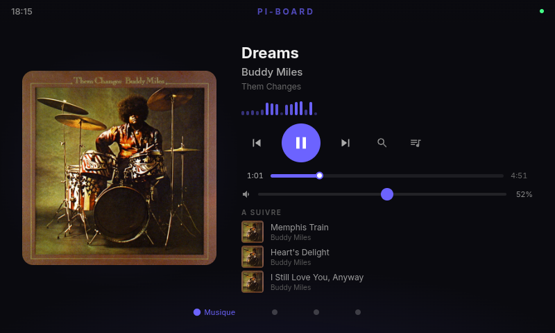
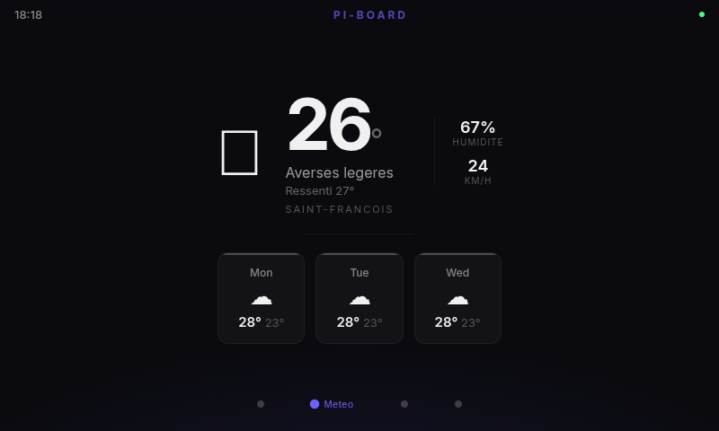

<p align="center">

```
 _____ _  _____ ____
| ____| |/ /_ _|  _ \
|  _| | ' / | || |_) |
| |___| . \ | ||  __/
|_____|_|\_\___|_|       ASSISTANT
```

**Un assistant vocal DIY avec ecran tactile sur Raspberry Pi**

</p>

<p align="center">
  <a href="#"></a>
  <a href="#"></a>
  <a href="#"></a>
  <a href="#"></a>
  <a href="#"></a>
</p>

<p align="center">
  <a href="README.md">English</a> |
  <strong>Francais</strong> |
  <a href="README_ES.md">Espanol</a>
</p>

---

Ekip Assistant est une **alternative open-source et respectueuse de la vie privee a l'Amazon Echo Show**. Construit sur un Raspberry Pi 4 avec un ecran tactile 7", il repond a votre voix et a vos gestes. Pas de dependance cloud pour les fonctionnalites de base — uniquement des appels API cibles pour la reconnaissance vocale, la musique et la meteo.

Ne en **Guadeloupe**, construit avec passion, et concu pour tourner 24h/24 sur votre table de nuit ou votre plan de cuisine.

## Fonctionnalites

- **Mot de reveil personnalise** — Entrainez un mot de reveil avec VOTRE voix grace a EfficientWord-Net (fallback : openWakeWord)
- **Commandes vocales en francais** — "Hey Ekip, mets du jazz" et ca joue du jazz sur vos enceintes
- **Interface swipe a 4 pages** — Musique, Meteo, YouTube, Cameras de securite
- **Integration Spotify Connect** — Diffuse la musique directement sur vos enceintes haut de gamme (Devialet, Sonos, etc.)
- **Previsions meteo** — Conditions actuelles et previsions 3 jours via Open-Meteo
- **Lecture YouTube** — Recherche vocale ou tactile, lecture via VLC avec audio route vers vos enceintes
- **Cameras de securite** — Snapshots en direct des cameras UniFi Protect sur votre reseau local
- **Panneau d'administration web** — Configurez tout depuis votre telephone ou navigateur
- **Theme sombre** — Optimise pour un affichage permanent, agreable la nuit
- **Veille/reveil automatique** — L'ecran s'eteint a 22h, se rallume a 6h, volume nuit des 20h
- **Speech-to-Text** — OpenAI GPT-4o-transcribe pour une transcription francaise precise
- **Text-to-Speech** — OpenAI TTS pour des reponses vocales naturelles
- **Ducking audio intelligent** — Le volume baisse quand l'assistant parle, puis remonte

## Captures d'ecran

| Musique | Meteo | YouTube |
|:-------:|:-----:|:-------:|
|  |  |  |

## Architecture

```
Chromium Kiosk (plein ecran, port 8000)
  +-- Svelte SPA <--> WebSocket <--> Backend FastAPI
       |
       +-- AudioCapture (micro USB, 44.1kHz -> 16kHz resampling)
       |    +-- WakeWordDetector (EfficientWord-Net / openWakeWord)
       |         +-- STT (OpenAI GPT-4o-transcribe)
       |              +-- IntentRouter (mots-cles + fallback LLM)
       |                   +-- MusicController (Spotify Connect)
       |                   +-- WeatherService (Open-Meteo)
       |                   +-- YouTubeController (yt-dlp + VLC)
       |                   +-- CameraService (UniFi Protect)
       |                   +-- LLMHandler -> TTS -> PipeWire -> AirPlay
       |
       +-- Panneau Admin (/admin)
            +-- Entrainement mot de reveil, config, monitoring systeme
```

### Flux du pipeline vocal

1. Le micro USB capture l'audio en continu (44.1kHz, reechantillonne a 16kHz)
2. Le detecteur de mot de reveil ecoute votre hotword personnalise
3. A la detection, la musique est baissee et 8 secondes d'audio sont capturees
4. L'audio est envoye a OpenAI GPT-4o-transcribe pour la transcription en francais
5. Le routeur d'intents fait du matching par mots-cles (zero cout) ou utilise le LLM en fallback
6. Le handler correspondant execute l'action (jouer de la musique, lire la meteo, etc.)
7. La reponse TTS est generee et jouee via PipeWire vers vos enceintes
8. Le systeme retourne en veille, la detection du mot de reveil reprend apres un cooldown

## Materiel requis

| Composant | Modele | Notes |
|-----------|--------|-------|
| **SBC** | Raspberry Pi 4 (4 Go RAM) | ARM64, Raspberry Pi OS Bookworm 64-bit |
| **Ecran** | Raspberry Pi Touch Display 2 (7") | 720x1280, capacitif, connecteur DSI |
| **Micro** | ReSpeaker Lite USB 2-Mic Array | Ou tout microphone USB |
| **Enceintes** | Devialet / Sonos / toute enceinte AirPlay | Spotify Connect + AirPlay via PipeWire |
| **Stockage** | microSD 32 Go+ (classe A2 recommandee) | |
| **Reseau** | WiFi ou Ethernet | Pi et enceintes sur le meme LAN |

> **Note :** Le Pi ne joue PAS l'audio directement. Les flux Spotify vont des serveurs Spotify directement a vos enceintes via Spotify Connect. Le TTS et l'audio YouTube transitent par PipeWire vers AirPlay.

## Demarrage rapide

### Prerequis

- Raspberry Pi 4 avec Raspberry Pi OS Bookworm (64-bit)
- Un microphone USB
- Des enceintes compatibles Spotify Connect sur votre reseau
- Des cles API (voir [Configuration](#configuration))

### 1. Cloner et installer

```bash
git clone https://github.com/YOUR_USERNAME/ekip-assistant.git
cd ekip-assistant
chmod +x scripts/*.sh
./scripts/setup.sh
```

Cela installe toutes les dependances systeme, cree un environnement virtuel Python, installe les paquets Python et compile le frontend.

### 2. Configurer

```bash
cp .env.example .env
nano .env
```

Remplissez vos cles API (voir [Configuration](#configuration) ci-dessous).

### 3. Lancer

```bash
./scripts/start.sh
```

Cela demarre le backend FastAPI sur le port 8000 et ouvre Chromium en mode kiosque.

### 4. (Optionnel) Demarrage automatique au boot

```bash
sudo cp systemd/piboard-backend.service /etc/systemd/system/
sudo cp systemd/piboard-kiosk.service /etc/systemd/system/
sudo systemctl enable piboard-backend piboard-kiosk
sudo systemctl start piboard-backend piboard-kiosk
```

## Configuration

Creez un fichier `.env` depuis l'exemple :

```bash
# Speech-to-Text + Text-to-Speech + LLM
OPENAI_API_KEY=sk-...              # openai.com — utilise pour STT, TTS et LLM

# Spotify
SPOTIFY_CLIENT_ID=...              # developer.spotify.com
SPOTIFY_CLIENT_SECRET=...
SPOTIFY_REDIRECT_URI=http://127.0.0.1:8888/callback
SPOTIFY_DEVICE_NAME=Devialet       # Nom exact de votre enceinte Spotify Connect

# Meteo (Open-Meteo est gratuit, pas de cle necessaire)
WEATHER_CITY=Guadeloupe
WEATHER_LAT=16.25
WEATHER_LON=-61.58

# UniFi Protect (optionnel — pour les cameras de securite)
UNIFI_HOST=192.168.1.18
UNIFI_USER=admin
UNIFI_PASS=...

# Audio
PIPEWIRE_AIRPLAY_SINK=Devialet     # Nom de votre sink AirPlay PipeWire
RESPEAKER_DEVICE=hw:ReSpeaker,0    # Nom du device ALSA de votre micro USB

# Serveur
BACKEND_PORT=8000
FRONTEND_PORT=3000
```

### Obtenir les cles API

| Service | Ou l'obtenir | Cout |
|---------|-------------|------|
| **OpenAI** | [platform.openai.com](https://platform.openai.com) | A la consommation (minimal pour un assistant vocal) |
| **Spotify** | [developer.spotify.com](https://developer.spotify.com) | Gratuit (necessite Spotify Premium pour la lecture) |
| **UniFi Protect** | Cloud Key UniFi local | Gratuit (necessite du materiel UniFi) |

> Open-Meteo est utilise pour la meteo et ne necessite aucune cle API.

## Structure du projet

```
ekip-assistant/
+-- backend/
|   +-- main.py                  # App FastAPI, WebSocket, pipeline vocal
|   +-- config.py                # Variables d'environnement et constantes
|   +-- audio/
|   |   +-- capture.py           # Flux audio micro USB (PyAudio)
|   |   +-- wakeword.py          # Detection mot de reveil (EfficientWord-Net + openWakeWord)
|   |   +-- output.py            # Sortie audio PipeWire
|   |   +-- models/              # Modeles ONNX du mot de reveil
|   |   +-- hotword_refs/        # Fichiers de reference du mot de reveil personnalise
|   +-- services/
|   |   +-- stt.py               # Speech-to-Text (OpenAI GPT-4o-transcribe)
|   |   +-- tts.py               # Text-to-Speech (OpenAI TTS)
|   |   +-- llm.py               # LLM pour les intents complexes (GPT-4o-mini)
|   |   +-- spotify.py           # API Web Spotify (Spotipy)
|   |   +-- weather.py           # Donnees meteo (Open-Meteo)
|   |   +-- youtube.py           # Recherche YouTube + lecture VLC (yt-dlp)
|   |   +-- cameras.py           # Snapshots cameras UniFi Protect
|   +-- intent/
|   |   +-- router.py            # Classification d'intents (mots-cles + fallback LLM)
|   +-- admin/
|       +-- routes.py            # Routes API du panneau admin
|       +-- auth.py              # Authentification admin
|       +-- config_manager.py    # Configuration en temps reel
|       +-- static/              # Frontend compile du panneau admin
+-- frontend/
|   +-- src/
|   |   +-- App.svelte           # App principale avec navigation swipe
|   |   +-- pages/
|   |   |   +-- Music.svelte     # Interface lecteur Spotify
|   |   |   +-- Weather.svelte   # Affichage meteo
|   |   |   +-- YouTube.svelte   # Recherche et lecteur YouTube
|   |   |   +-- Cameras.svelte   # Grille cameras de securite
|   |   +-- components/
|   |   |   +-- WaveAnimation.svelte    # Animation d'ecoute vocale
|   |   |   +-- VirtualKeyboard.svelte  # Clavier virtuel
|   |   +-- stores/
|   |       +-- assistant.js     # Store Svelte (etat global)
|   +-- admin/                   # Panneau admin (app Svelte separee)
|       +-- src/pages/           # Dashboard, Voice, Audio, Music, etc.
+-- scripts/
|   +-- setup.sh                 # Script d'installation complete
|   +-- start.sh                 # Lancer backend + Chromium kiosque
|   +-- deploy-pi.sh             # Deployer depuis la machine de dev vers le Pi via scp
|   +-- record_wakeword.py       # Enregistrer des echantillons de mot de reveil
|   +-- test_audio.sh            # Verifier le micro et PipeWire
+-- systemd/
|   +-- piboard-backend.service  # Service systemd pour le backend
|   +-- piboard-kiosk.service    # Service systemd pour Chromium kiosque
+-- requirements.txt             # Dependances Python
+-- LICENSE                      # Licence MIT
```

## Commandes vocales

Ekip Assistant comprend les commandes vocales en francais. Voici quelques exemples :

| Commande | Action |
|----------|--------|
| *"Hey Ekip, mets du jazz"* | Cherche et joue du jazz sur Spotify |
| *"Hey Ekip, joue Stromae"* | Joue Stromae sur vos enceintes |
| *"Hey Ekip, pause"* | Met en pause le morceau en cours |
| *"Hey Ekip, suivant"* | Passe au morceau suivant |
| *"Hey Ekip, plus fort"* | Augmente le volume |
| *"Hey Ekip, moins fort"* | Baisse le volume |
| *"Hey Ekip, meteo"* | Lit les previsions meteo a voix haute et bascule sur la page meteo |
| *"Hey Ekip, YouTube Stromae"* | Cherche sur YouTube et lance le premier resultat via VLC |
| *"Hey Ekip, stop video"* | Arrete la lecture YouTube |
| *"Hey Ekip, dodo"* | Eteint l'ecran (mode veille) |
| *"Hey Ekip, debout"* | Rallume l'ecran |
| *"Hey Ekip, c'est quoi la capitale du Japon ?"* | Question generale traitee par le LLM |

> **Astuce :** Le mot de reveil est personnalisable. Vous pouvez entrainer le votre via le panneau d'administration ou le script `scripts/record_wakeword.py`.

## Controles tactiles

- **Swipe haut/bas** pour naviguer entre les pages (Musique -> Meteo -> YouTube -> Cameras)
- **Appuyez** sur play/pause, suivant/precedent sur la page Musique
- **Curseur de volume** sur la page Musique
- **Barre de recherche** sur la page YouTube avec clavier virtuel
- **Appuyez** sur une camera pour voir son snapshot

## Panneau d'administration

Accedez au panneau d'administration a l'adresse `http://ip-de-votre-pi:8000/admin` depuis n'importe quel appareil sur votre reseau.

Fonctionnalites :
- **Dashboard** — Etat du systeme, sante des services, uptime
- **Voice** — Entrainement du mot de reveil (enregistrer des echantillons, tester la detection)
- **Audio** — Niveaux du micro, selection du sink PipeWire
- **Music** — Etat de la connexion Spotify, selection de l'appareil
- **Weather** — Parametres de localisation
- **YouTube** — Parametres de lecture
- **Cameras** — Configuration UniFi Protect
- **Screen** — Luminosite, planning de veille
- **System** — Logs, redemarrage des services
- **Interface** — Personnalisation de l'interface

## Developpement

### Developper sur Mac, deployer sur Pi

Le workflow recommande est de developper sur votre Mac et deployer sur le Pi :

```bash
# Sur votre Mac — editer le code, puis deployer
./scripts/deploy-pi.sh

# Sur le Pi — redemarrer le service
sudo systemctl restart piboard-backend
```

> **Note :** Node.js et npm ne sont PAS installes sur le Pi. Compilez toujours le frontend sur votre Mac avant de deployer.

### Lancer en local (Mac)

Le backend peut tourner sur macOS pour le developpement, mais la capture audio et la detection du mot de reveil necessitent du mocking car il n'y a ni ReSpeaker ni PipeWire :

```bash
# Creer le venv et installer les deps
python3 -m venv .venv
source .venv/bin/activate
pip install -r requirements.txt

# Compiler le frontend
cd frontend && npm install && npm run build && cd ..

# Lancer le backend (mode mock pour l'audio)
cd backend && uvicorn main:app --host 0.0.0.0 --port 8000 --reload
```

### Stack technique

| Couche | Technologie |
|--------|------------|
| Backend | Python 3.11, FastAPI, asyncio, WebSocket |
| Frontend | Svelte 4, Vite 5 |
| Capture audio | PyAudio, numpy, scipy (reechantillonnage) |
| Mot de reveil | EfficientWord-Net (personnalise) + openWakeWord (fallback) |
| Speech-to-Text | OpenAI GPT-4o-transcribe |
| Text-to-Speech | OpenAI TTS |
| LLM | OpenAI GPT-4o-mini (fallback intents + questions generales) |
| Musique | Spotipy (API Web Spotify + Spotify Connect) |
| Video | yt-dlp + VLC |
| Meteo | Open-Meteo (gratuit, pas de cle API) |
| Cameras | API REST UniFi Protect |
| Routage audio | PipeWire + RAOP (AirPlay) |
| Affichage | Chromium en mode kiosque (Wayland) |

## Depannage

### Problemes courants

**Micro non detecte :**
```bash
arecord -l                         # Lister les peripheriques de capture ALSA
pactl list sources | grep -i name  # Lister les sources PipeWire
```

**Pas de sortie audio vers les enceintes :**
```bash
pactl list sinks | grep -i devialet  # Verifier si le sink AirPlay est visible
wpctl status                          # Verifier l'etat PipeWire/WirePlumber
```

**Spotify ne se connecte pas :**
- Verifiez que vous avez Spotify Premium
- Verifiez que `SPOTIFY_DEVICE_NAME` dans `.env` correspond exactement au nom de votre enceinte dans l'app Spotify
- Lancez le backend une premiere fois manuellement pour completer le flux OAuth

**Le mot de reveil ne se declenche pas :**
- Verifiez les niveaux du micro dans le panneau admin
- Essayez de baisser le seuil dans `backend/audio/wakeword.py`
- Re-enregistrez des echantillons du mot de reveil via le panneau admin

**L'ecran ne s'allume/s'eteint pas :**
```bash
# Verifier le controle du retro-eclairage
cat /sys/class/backlight/10-0045/brightness
echo 255 | sudo tee /sys/class/backlight/10-0045/brightness  # Allumer
echo 0 | sudo tee /sys/class/backlight/10-0045/brightness    # Eteindre
```

## Contribuer

Les contributions sont les bienvenues ! C'est un projet passion, et il y a toujours de la place pour l'amelioration.

1. Forkez le depot
2. Creez une branche feature (`git checkout -b feature/ma-fonctionnalite`)
3. Commitez vos changements (`git commit -m 'Ajout de ma fonctionnalite'`)
4. Poussez la branche (`git push origin feature/ma-fonctionnalite`)
5. Ouvrez une Pull Request

### Idees de contributions

- Support multilingue des commandes vocales (anglais, espagnol, creole)
- Integration domotique (Home Assistant, MQTT)
- Page calendrier et rappels
- Fonctionnalite reveil/alarme
- Streaming radio/podcast
- Reconnaissance de gestes par camera
- Meilleurs modeles de mot de reveil

## Credits

- Construit par **Anthony D.** en Guadeloupe
- Propulse par [FastAPI](https://fastapi.tiangolo.com/), [Svelte](https://svelte.dev/), [Spotipy](https://spotipy.readthedocs.io/), [yt-dlp](https://github.com/yt-dlp/yt-dlp), [EfficientWord-Net](https://github.com/Ant-Brain/EfficientWord-Net), [openWakeWord](https://github.com/dscripka/openWakeWord)
- Donnees meteo par [Open-Meteo](https://open-meteo.com/)
- Services vocaux par [OpenAI](https://openai.com/)

## Licence

Ce projet est sous **licence MIT** — voir le fichier [LICENSE](LICENSE) pour les details.

---

<p align="center">
  Fait avec soin en Guadeloupe
  <br>
  <em>Un projet du soleil pour votre maison</em>
</p>
